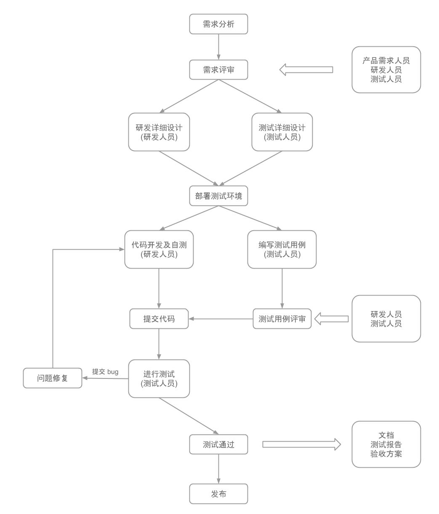
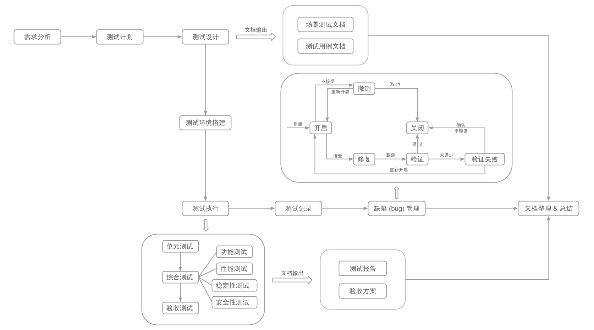
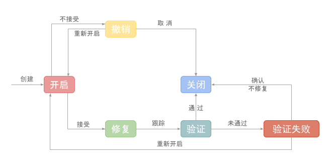

软件测试测试作为软件生命周期的一部分，有一个规范的流程。对 EayunStack 来讲，其相对于一般软件的复杂性和特殊性（模块大而杂），一个规范的软件测试流程更显得尤为重要。

## 概述

对于同一个软件缺陷，在不同的阶段发现和修复，其成本是不同的。一般来说，缺陷发现得越晚，其修复成本将越来越高。因此，软件测试与软件开发应该紧密结合，其流程如下图所示：

对于 EayunStack 项目来讲，测试从项目确立时就已经开始了，前后经过以下一些主要环节：

* 需求分析→测试计划→测试设计→测试环境搭建→测试执行→测试记录→缺陷 (bug) 管理→文档整理和总结

## 测试流程

测试流程如下图所示：

### 需求分析

需求分析在软件开发中非常重要，部门的开发人员和测试人员对其的理解程度直接影响到后续的一系列工作开展。

对需求进行分析，首先要对 EayunStack 整体有一定的了解，该平台能做什么，能实现什么，以便指导测试研发工作。

### 测试计划

EayunStack 的测试计划由测试负责人来编写。
  
以项目开发计划和测试需求分析结果为主要依据。一般包括以下方面：

1. 测试背景

  * 项目介绍；
  * 项目涉及人员（如软硬件项目负责人等）介绍以及相应联系方式等。

1. 测试依据
       
  * 项目需求文档；
  * 项目规格书；
  * 项目详细设计文档；
  * 其他。

1. 测试资源

  * 测试人员需求；
  * 测试环境需求；
  * 其他。
 
1. 测试方案

  * 测试方法；
  * 搭建哪些测试环境；
  * 测试工具、测试管理工具。

1. 测试日程

  * 测试需求分析和测试设计；
  * 测试用例编写；
  * 测试实施，根据项目计划，测试分成哪些测试阶段（如单元测试、集成测试、功能测试阶段等），每个阶段的工作重点以及投入资源等。

1. 其他

此外，测试计划还要包括测试计划编写的日期、作者等信息。

### 测试设计

主要包括测试用例的编写和场景测试的设计。

#### 测试用例的编写

测试用例的编写有其固定的格式，包含以下内容：

| 用例编号 | 测试目的 | 操作 | 预期结果 | 实际结果 | 备注 |
|----------|----------|------|----------|----------|------|
|||||||

#### 场景测试的设计

对于小型项目(比如一个app，一个简单的web管理系统之类的项目)，对功能点进行完整的多次的测试是可行的，也是必须的。但对于较大的项目，要覆盖所有的功能点，是几乎不可能的事情。对于这类项目，需要采取更高效的方式，比如一定要有自动化测试，一定要设计一些相应的场景测试，尽可能的将功能覆盖。

总之，要针对项目，考虑时间成本等问题，对测试的深度和广度进行合理地设计。

### 测试环境搭建

研发人员进行开发时，尽可能现在自己的测试环境上进行单元测试，对自己所写部分的代码进行测试。而对整个项目的测试，应该搭建一个测试环境。

如果不考虑成本，测试环境应该与上线后的生产环境**完全相同**。考虑到 EayunStack 的实际情况，前期允许有一些可控范围的差异。

### 测试执行

基于测试设计，执行测试。根据上图情况，测试还需要再分为几个阶段：

* 单元测试→综合测试→验收测试
  * 其中每个阶段还有回归测试等。

其中，功能测试可以认为是将系统集成以后进行的测试，其中包括**功能测试**、**性能测试**、**稳定性测试**、**安全性测试**等。

进行验收测试时，项目已经进入收尾阶段，根据验收方案，对项目进行验收。

在这个阶段中，应该输出的文档有：测试报告、验收方案。验收完成后，应该输出验收报告。

### 测试记录

缺陷记录总的说来包括两方面：缺陷提交者和缺陷描述。

一般而言，缺陷都是由测试执行者提交。

* 在编写测试记录时，应记录的作者信息如下： 
 
| 项目名称 | 项目版本 | 测试日期 | 测试人员 |
|----------|----------|----------|----------|
|||||

### 缺陷 (bug) 管理

对于缺陷的管理，一般使用缺陷管理工具。如：Github 上的 issue，Redmine 等。

缺陷的生命周期图所示：

1. 当发现一个 bug 时，创建一个 bug 的管理，此时，这个 bug 处于开启 (open) 的状态；

  * 如果研发人员接受这个 bug，则进入 (3) 修复阶段；
  * 如果研发人员不接受这个 bug，则撤销这个 bug，进入 (2) 状态；

1. 撤销 bug 后，bug 进入 (6) 关闭状态；
1. 研发人员修复 bug，测试人员对 bug 进行跟踪；
1. 修复完成后，测试人员验证 bug；

  * 如果测试通过，则 bug 关闭；
  * 如果测试未通过，则验证失败，进入 (5) 状态；

1. 验证失败后，对 bug 进行评审；

  * 如果需要继续修复，则 bug 重新开启，重新进入 (1)；
  * 如果确认不需要修复，则 bug 关闭，进入 (6)；

1. bug 关闭。

根据上述 bug 生命周期，修复的 bug 需要进行验证，这也是为什么要进行*回归测试*的原因。

测试人员提交 bug 时，应该包含如下内容：

  * 缺陷简要描述：对所出现的 bug 进行描述；
  * 环境描述：对出现 bug 的环境进行描述，包括项目版本号等；
  * 复现方法：复现出现该 bug 的方法；
  * 预期结果和实际结果：描述预期结果和实际结果的差异；
  * 日志：如果收集到日志记录，应将日志附加。

### 文档整理 & 总结

测试结束后，对测试所输出的文档进行整理和总结，可以作为以后测试工作的借鉴，不断完善测试流程。

